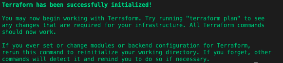
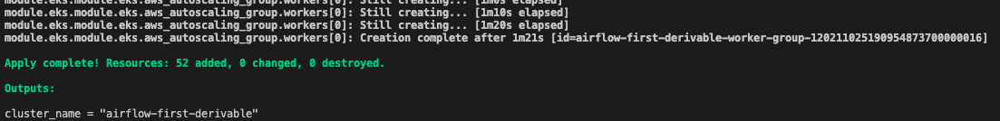
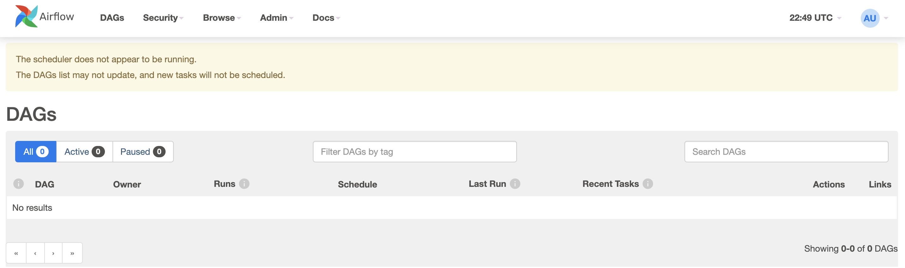
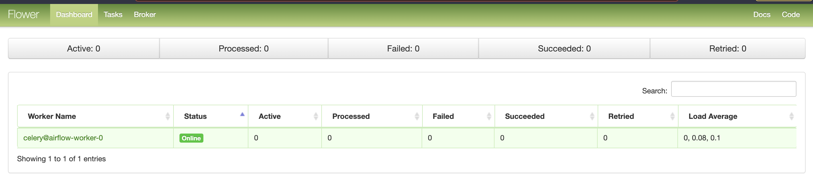

# First Derivable


Based on the self-study material, recorded and live session, and mentorship covered until this deliverable, we suggest you perform the following:
Take as reference Terraform reference, identify and select the corresponding terraform blocks to build your own Airflow Cluster.
Airflow Cluster must be built with GKS in Google or EKS in AWS.
In case of some difficulties, take advantage of templates provided by Wizeline to build and start your Airflow Cluster.
Take your notes about any blocker and your lessons learned to be discussed during Q&A and Mentoring sessions.


Outcome:
Terraform blocks to build and run your Airflow Cluster.
(Optional) Automation process to run Terraform blocks as part of the main Data Pipeline

TODO:
- Find a way to use kubernetes and helm with terraform to start with blocks the airflow cluster


To start deploying I followed the next steps:

```bash
cd terraform-blocks-aws-eks-kubectl-helm-airflow 
```
Once in the correct folder we can start using the terraform commands

```bash
terraform init
```

After executing init you get the following message:



After init you perform the terraform apply with the option var-file to pass the variables needed 

```bash
terraform apply --var-file=terraform.tfvars
```

After apply and accepting the terraform message that you accept the plan and want to perform the actions, you should see the following:



After having the resources up and running we can execute the next command to set the kubectl context:

```bash
aws eks --region $(terraform output -raw region) update-kubeconfig --name $(terraform output -raw cluster_name)
```

Lesson learned: This help us to communicate with the local kubernetes command line and the EKS in AWS

Then we continue to export the NFS_SERVER for airflow using the terraform output using the command:

```bash
export NFS_SERVER=$(terraform output -raw efs)
```

Then we need to execute the kubectl command in bash to create a storage with the command

```bash
kubectl create namespace storage
```

And we will receive a message that the namespace is created

Then we use helm to add a heml chart to the nsf-provider
```bash
helm repo add nfs-subdir-external-provisioner https://kubernetes-sigs.github.io/nfs-subdir-external-provisioner/
```
And we will receive a message that the repo is added or it already exists

then we proceed to Install the nfs-external-provisioner with the following command.

```bash
helm install nfs-subdir-external-provisioner nfs-subdir-external-provisioner/nfs-subdir-external-provisioner \
    --namespace storage \
    --set nfs.server=$NFS_SERVER \
    --set nfs.path=/
```

Lesson learned: The export only works one time in the cmd line so if you restart the cmd line or something else you need to re do the export nfs_server again to avoid problems with the installation.


Now for Airflow:

We need to create a namespace with kubectl for airflow

```bash
kubectl create namespace airflow
```

Now we add the helm repo:

```bash
helm repo add apache-airflow https://airflow.apache.org
```
Then we need to update the file  `airflow-values.yaml` and add the information of the github repo and the dags folder.

Lessons learned: Be careful in the github repository, you need to copy it like a clone

Then we install the airflow chart from the repository

```bash
helm install airflow -f airflow-values.yaml apache-airflow/airflow --namespace airflow
```

And now we have airflow installed, and we need to execute the kubectl commands to run the webserver and airflower.

```bash
Airflow Webserver:     kubectl port-forward svc/airflow-webserver 8080:8080 --namespace airflow
Flower dashboard:      kubectl port-forward svc/airflow-flower 5555:5555 --namespace airflow
```

And now we can see the service up and running!





Lesson learned: use the following command to see the pods: kubectl get pods -n airflow


Lessons learned: Initialize the airflow service using kubectl and helm.

Lessons learned: To log into the kubernetes bash terminal use the following: kubectl exec -ti airflow-scheduler-nnn-nnn -- /bin/bash (You need to know first the correct name of your airflow scheduler, you can find the name using the get pods command above)