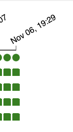
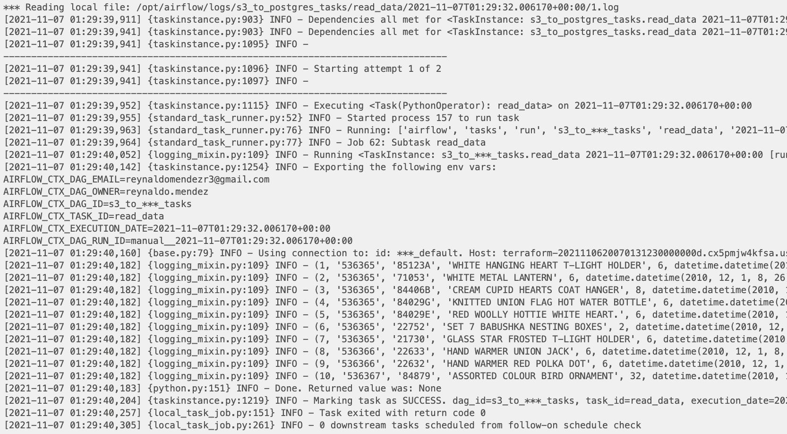

Second Deliverable (due October 31st, 11:59 PM)

Based on the self-study material, recorded and live session, and mentorship covered until this deliverable, we suggest you perform the following:
Use your up and running Airflow Cluster to create your DAGs. 
Think about the best way to design your data pipeline. Remember to include new concepts you are learning in previous weeks.
Use terraform blocks to set up your environment, you will need to create a new PostgreSQL DB with one table named user_purchase. (PostgreSQL_Table_Schema.png)
Use Airflow to upload the user_purchase.csv file into the new PostgreSQL table. Rememer there's more than 1 way to complete this step.

Outcome:
PostgreSQL table named user_purchase.
Airflow job to load user_purchase.csv in user_purchase table.
Terraform blocks to create PostgreSQL DB and table. Also, IAM needed to integrate Airflow Cluster and SQL service.
(Optional) Automation process to run Terraform blocks as part of the main Data Pipeline

To start you must follow the steps on the first derivable to start the airflow service.

Important: Change the values.yaml on the first derivable project with this github repo path to use the .py files as dags

Lesson Learned: Don't waste to much time learning terraform if you don't want to be a SRE.

Then follow this steps:

1. Setup connections with the airflow UI interface.

2. Setup IAM roles and policies need for S3 and postgress communication. (Made manually using the AWS Webpage)

6. Go to the airflow-ui and set the s3_to_postgres_tasks DAG to unpaused.

7. Click on the name to see the tree view and check everything is working. 

8. Enjoy and see the log with the result.

9. terraform destroy

Lesson's learned, 
1. we need to delete the s3 files in order for terraform to destroy the S3 Buckets.
2. You can create an aws s3 extension to copy data directly from s3.
3. To use seria id with a copy statement from a file you need to specify the columns that the file has.
4. Eiffel put a lot of commas on the csv files be careful with people that want's to watch the world burn. (JK he's a great mentor :D)

TODO's:
- Finish IAM module with terraform.
- Read more about STS tokens for security practices.
- Fully automate the data pipeline.
- Create function that sends local files to S3.

