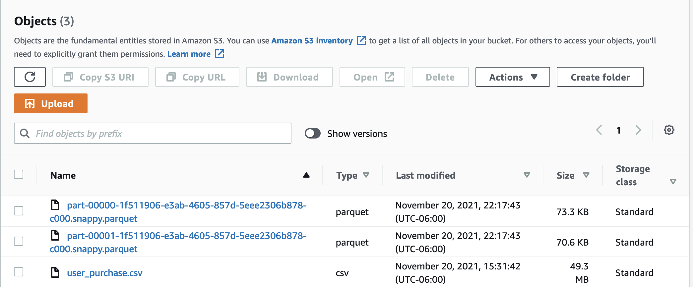

Third Deliverable (due November 21st, 11:59 PM)

Based on the self-study material, recorded and live session, and mentorship covered until this deliverable, we suggest you perform the following:
Use your up and running Airflow Cluster to create your DAGs. 
Think about the best way to design your data pipeline. Remember to include new concepts you are learning in previous weeks.
Use terraform blocks to set up your environment, you will need to create storage resources. S3 for AWS and Cloud Storage for GCP. One bucket for your Raw Layer and the other for your Staging Layer.
Upload movie_review.csv file in your Raw Layer.
Now it is time to process your data. You have the opportunity to work in a self-managed service such as EMR cluster as follow:
               * Use terraform blocks to create your EMR cluster
               * Read your PostgreSQL table and write the data in your Staging Layer
               * Read movie_review.csv from your Raw Layer and write the result in your Staging Layer following the logic listed below. (Classification Movie Review Logic)
Another way to process your data is by running serverless services such as Glue in AWS and Dataflow in GCP.  
               * Figure out how to work with fully-managed services + Airflow + Terraform
               * Read your PostgreSQL table and write the data in your Staging Layer
               * Read movie_review.csv from your Raw Layer and write the result in your Staging Layer following the logic listed below. (Classification Movie Review Logic)

Classification Movie Review Logic:
From the movie_review.csv file, work with the user_id and review_str columns to get a list of words used by users. 
You can implement pyspark.ml.feature.Tokenizer class to create a list of words named review_token. But feel free to implement a different approach.
Remove stop words if needed with the pyspark.ml.feature.StopWordsRemover class. If you want to play with the data, add a larger list of good words and stop words.
For this exercise look for data that contain the word  “good”, considering the review as positive, and name it as positive_review.
Select the appropriate file format for the next steps.
Use the following logic to convert positive_review from a boolean to an integer:
             reviews.positive_review = CASE
                                                              WHEN positive_review IS True THEN 1
                                                              ELSE 0                                                          END
Save the data in your Staging layer. What you need is user_id, positive_review.

Outcome:
Classified movie reviews in Staging Layer named reviews. 
PostgreSQL exported data I Staging Layer named user_purchase.
Terraform blocks to create Raw and Staging, create and run distributed environment (e.g. EMR). Also, IAM needed to integrate Airflow Cluster with the rest of the cloud services used in your Data Pipeline.
Code where you run the Classification Movie Review Logic in a distributed manner.
(Optional) Automation process to run Terraform blocks as part of the main Data Pipeline

Notes: 
What has been listed in this deliverable is just for guidance and to help you distribute your workload; you can deliver more or fewer items if necessary. However, if you deliver fewer items at this point, you have to cover the remaining tasks in the next deliverable.
Your mentor will post the feedback comments on your mentoring session. For reference, take a look at the DE Bootcamp calendar.

We are going to use the first and second derivable folders to continue using the infrastructure created with terraform, in the first module we added new modules containing new s3 buckets, emr and iam modules.

In the second derivable folder we are storing all the dags and spark jobs that will be used.

For the first task Read your PostgreSQL table and write the data in your Staging Layer we are using a new python file called postgresToS3.py

So the steps for the datapipeline to work are the following:

Run all the steps on the readme.md on the first_derivable folder to initialize all the insfraestructure needed.

Set the airflow connections.
TODO: find a way to pass the rds connection and aws connection from terraform to airflow

Unpause the DAG s3_to_postgres_tasks

TODO: find a way to activate postgres_to_s3_tasks after s3_to_postgres tasks finishes

Unpause the DAG postgres_to_s3_tasks

Steps with GLUE for ETL:

 Manual way:
 1. Go to aws glue
 2. Create a crawler (connects to the aws bucket nd creates metadata tables in the data catalog)
 3. Give the crawler a name
 4. Choose a data store
 5. Include s3 path for the raw layer
 6. Create iam role - policy - attach role policy
 7. Select in the schedule option the run on demand option.
 8. Configure the crawler's output (database needed for glue crawler)
 9. Create job
 10. Give a name to the job
 11. Choose the iam role, type spark and glue version
 12. Edit glue job, found the script on the folder scripts
 13. Run job and wait for the parquet files to appear on the staging layer

 

TODO: Terraform module with Glue steps

